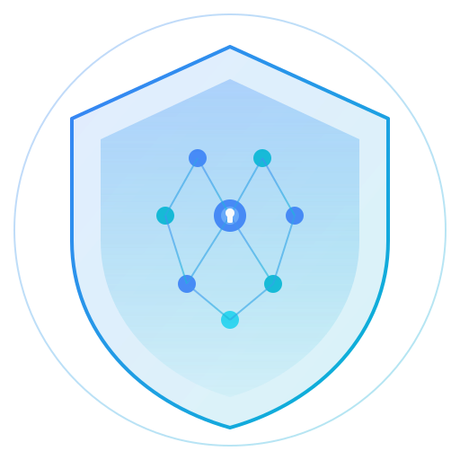

<p align="center">
  
</p>

<h1 align="center">Aya Shield</h1>

<p align="center">
  <strong>AI-Powered Transaction Firewall & Smart Receipt System</strong><br/>
  Protecting crypto users from scams, one transaction at a time.
</p>

<p align="center">
  
  
  
  
</p>

---

## What Problem Does Aya Shield Solve?

Crypto is broken for real people. Not the technology — the experience.

In 2025 alone, over **$5.6 billion** was lost to crypto scams, rug pulls, and wallet drains. Not because users were careless, but because **the tools failed them**. Here is the reality:

- **68% of wallet drains** happen through malicious token approvals. A user clicks "Approve" on what looks like a DEX swap, but they've actually given an unknown contract permission to take every token they own. The wallet shows `approve(address,uint256)` — meaningless to 99% of people.
- **4 out of 10 new tokens** listed on decentralized exchanges are honeypots. You can buy them, but the contract blocks you from selling. By the time you realize, the deployer has pulled all liquidity.
- **The average power user has 47+ active token approvals** scattered across chains. Most were granted months ago and forgotten. Any one of them could be exploited at any time.
- **The average victim recovers $0.** Blockchain transactions are irreversible. There is no bank to call, no chargeback to file. Once your funds move, they are gone.

The root cause is simple: **wallets show raw transaction data that nobody can read.** Users are forced to click "Confirm" and hope for the best. Every transaction is a blind leap of faith.

This is the problem Aya Shield was built to eliminate.

---

## Why We Built Aya Shield

We watched people — smart, careful people — lose their savings because a wallet showed them `0x095ea7b3` and expected them to understand it was an unlimited token approval to a 3-day-old contract.

Existing security tools are fragmented and reactive:
- **Revoke.cash** lets you revoke approvals, but only after the damage is visible.
- **Blowfish and Pocket Universe** simulate transactions, but only on specific chains and only as browser extensions.
- **Block explorers** show data, but require deep technical knowledge to interpret.

None of them combine **pre-transaction analysis + AI explanation + risk scoring + smart receipts + emergency revocation** in a single, unified experience. None of them speak plain English.

We built Aya Shield because:

1. **Security should be proactive, not reactive.** You shouldn't have to learn Solidity to avoid a scam. The system should warn you *before* you sign, not *after* you've been drained.
2. **AI is finally good enough to explain transactions to humans.** With Google Gemini 2.0 Flash, we can decode any transaction calldata and explain it in words anyone understands — "This will approve UNLIMITED USDC spending to an unverified 11-day-old contract. This is extremely dangerous."
3. **Crypto adoption depends on trust.** 82% of new users abandon onboarding after seeing scam horror stories. Making crypto feel safe is how we bring the next billion users in.

---

## How Aya Shield Works

Aya Shield sits between you and your transactions. It's a firewall — nothing gets signed without you understanding exactly what it does.

### Step 1: Decode

When you submit a transaction for analysis, Aya Shield:
- **Decodes the raw calldata** using standard ABI databases and function signature registries
- **Identifies the function** being called (`approve`, `transfer`, `swap`, `mint`, etc.)
- **Extracts parameters** — who the recipient is, how much is being sent, what token, and what permissions are being granted
- **Resolves the destination** — checks if the target address is a known protocol (Uniswap, Aave, OpenSea), a verified contract, or an unknown/flagged entity

Raw hex like `0x095ea7b3000000000000000000000000...` becomes: *"Approve 0x Protocol to spend unlimited USDC from your wallet."*

### Step 2: Score

Every transaction gets a **risk score from 0 to 100**, calculated from multiple signals:

| Signal | What It Checks |
|--------|---------------|
| **Approval analysis** | Is this an unlimited approval? Does the spender have a history of drains? |
| **Contract age** | How old is the contract? New contracts (< 7 days) are higher risk. |
| **Verification status** | Is the source code verified on Etherscan? Unverified = significant risk. |
| **Bytecode patterns** | Does the compiled code contain honeypot indicators, self-destruct, or proxy patterns? |
| **Scam databases** | Is this address flagged by GoPlus, Forta, Chainalysis, or community reports? |
| **Value at risk** | How much money is at stake in this transaction? |
| **Historical behavior** | Has this contract interacted normally, or does it show drain patterns? |

The score maps to clear risk levels:
- **0-29**: Low risk (green) — standard operations on known protocols
- **30-59**: Medium risk (yellow) — some flags, proceed with caution
- **60-79**: High risk (orange) — significant red flags detected
- **80-100**: Critical risk (red) — strong indicators of malicious intent

### Step 3: Explain

Google Gemini 2.0 Flash analyzes the full context and generates a **plain-English explanation**:

> *"This transaction calls the approve() function on the USDC token contract. It will grant the address 0xDEF1... (identified as 0x Protocol / DEX aggregator) permission to spend up to 115,792,089,237,316,195,423,570,985,008,687,907,853,269,984,665,640,564,039,457,584,007,913,129,639,935 USDC from your wallet. This is an UNLIMITED approval — the spender can withdraw your entire USDC balance at any time. While 0x Protocol is a legitimate DEX aggregator, unlimited approvals are risky. Consider setting a specific limit instead."*

No jargon. No hex. Just clear, actionable information.

### Step 4: Protect

Based on the analysis, Aya Shield:
- **Warns you** with specific, ranked threat indicators
- **Suggests safer alternatives** when possible (e.g., "limit this approval to 100 USDC instead of unlimited")
- **Logs everything** — every analysis is saved to your security history, building a picture of your on-chain safety posture
- **Generates receipts** for completed transactions — shareable visual cards showing what happened, what it cost, and what events were emitted

---

## Features

### Transaction Guard
Paste any pending transaction to get a full risk analysis before signing. The AI decodes calldata, identifies the function being called, checks if the target has been flagged, and rates the risk.

### Contract Analyzer
Deep-dive into any smart contract. Aya Shield checks source code verification status, bytecode patterns (honeypot indicators, proxy patterns, self-destruct), and cross-references against known scam databases.

### Smart Receipts
Beautiful, shareable SVG receipt cards for completed transactions. Shows what happened, what it cost, and what events were emitted — all in a visual format you can save or share.

### Emergency Revoke
One-click scan of all your token approvals across chains. Flags unlimited or risky approvals and generates the revoke transactions you need to submit to clean up.

### AI Chat Assistant
Ask security questions in plain English. "Is this contract safe?" "What does this approval mean?" The Gemini-powered agent answers using your transaction context, parses your intent, and can trigger analyses directly from conversation.

## Architecture

```
┌─────────────────┐     ┌──────────────────────┐     ┌─────────────────┐
│                  │     │                      │     │                 │
│   Next.js 15     │────▶│   FastAPI Backend     │────▶│   Blockchain    │
│   Frontend       │     │                      │     │   (EVM RPCs)    │
│                  │◀────│   - Shield Service    │◀────│                 │
│  - Dashboard     │     │   - AI (Gemini)       │     │  - Ethereum     │
│  - Analyze       │     │   - Risk Scoring      │     │  - Polygon      │
│  - Receipts      │     │   - Contract Analysis │     │  - Arbitrum     │
│  - Emergency     │     │   - Receipt Gen       │     │  - Base         │
│                  │     │   - Approval Scanner  │     │  - Optimism     │
└────────┬─────────┘     └──────────┬───────────┘     └─────────────────┘
         │                          │
         │                          │
         ▼                          ▼
┌─────────────────┐     ┌──────────────────────┐
│                  │     │                      │
│   Supabase       │     │   External APIs      │
│   - Auth (JWT)   │     │   - Etherscan        │
│   - PostgreSQL   │     │   - Google Gemini    │
│   - RLS Policies │     │   - Infura/Alchemy   │
│                  │     │                      │
└─────────────────┘     └──────────────────────┘
```

## Tech Stack

| Layer | Technology | Why |
|---|---|---|
| **AI** | Google Gemini 2.0 Flash | Fast, accurate intent parsing and natural language explanations |
| **Backend** | Python + FastAPI | Async, type-safe, auto-documented API |
| **Frontend** | Next.js 15 + React 19 | Server components, middleware auth guards, fast navigation |
| **Database** | Supabase (PostgreSQL) | Auth, RLS, real-time — no custom auth server needed |
| **Styling** | Tailwind CSS | Consistent dark theme with custom design tokens |
| **Blockchain** | httpx + eth-abi | Lightweight async RPC calls without full node dependencies |
| **Cache** | Redis | Rate limiting and response caching |
| **Deploy** | Docker Compose | One command to run everything |

## Quick Start

### Prerequisites

- Python 3.12+ with [uv](https://docs.astral.sh/uv/)
- Node.js 20+
- A [Supabase](https://supabase.com) project
- A [Google AI Studio](https://aistudio.google.com) API key
- An [Infura](https://infura.io) or [Alchemy](https://alchemy.com) API key

### 1. Clone and Install

```bash
git clone https://github.com/your-username/aya-shield.git
cd aya-shield

# Backend
cd backend
uv sync
cd ..

# Frontend
cd frontend
npm install
cd ..
```

### 2. Set Up the Database

1. Create a Supabase project at [supabase.com](https://supabase.com)
2. Go to **SQL Editor** in your Supabase dashboard
3. Run the migration file: `database/migrations/001_initial.sql`

This creates 5 tables with Row Level Security:

| Table | Purpose |
|---|---|
| `profiles` | User profiles (extends Supabase auth.users) |
| `shield_events` | Audit log for every analysis, receipt, and revoke |
| `approvals` | Cached token approvals per wallet |
| `scam_reports` | Aggregated scam report data |
| `receipts` | Generated receipt card records |

### 3. Configure Environment Variables

**Backend** — copy `backend/.env.example` to `backend/.env`:

```env
SUPABASE_URL=https://your-project.supabase.co
SUPABASE_ANON_KEY=your-anon-key
SUPABASE_SERVICE_ROLE_KEY=your-service-role-key
GEMINI_API_KEY=your-gemini-api-key
INFURA_KEY=your-infura-key
ETHERSCAN_API_KEY=your-etherscan-key
```

**Frontend** — copy `frontend/.env.local.example` to `frontend/.env.local`:

```env
NEXT_PUBLIC_SUPABASE_URL=https://your-project.supabase.co
NEXT_PUBLIC_SUPABASE_ANON_KEY=your-anon-key
NEXT_PUBLIC_API_URL=http://localhost:8000
```

### 4. Run

**Option A — Local development (two terminals):**

```bash
# Terminal 1: Backend
npm run dev:backend

# Terminal 2: Frontend
npm run dev:frontend
```

**Option B — Docker (everything in one command):**

```bash
npm run docker:up
```

Open [http://localhost:3000](http://localhost:3000) and create an account to start.

## API Reference

All endpoints are at `http://localhost:8000/api/v1`. Interactive docs at `/api/docs` when `DEBUG=true`.

### Shield

| Endpoint | Method | Description |
|---|---|---|
| `/shield/analyze-transaction` | POST | Decode + risk-score a transaction before signing |
| `/shield/analyze-contract` | POST | Deep analysis of a smart contract |
| `/shield/generate-receipt` | POST | Generate visual SVG receipt for a completed tx |
| `/shield/emergency-revoke` | POST | Scan wallet for risky approvals + build revoke txs |
| `/shield/status` | POST | Shield status for a specific wallet |
| `/shield/status/me` | GET | Dashboard stats for the authenticated user |
| `/shield/chat` | POST | AI security assistant |

### Auth

| Endpoint | Method | Description |
|---|---|---|
| `/auth/signup` | POST | Create account (email + password) |
| `/auth/login` | POST | Sign in, receive JWT tokens |
| `/auth/refresh` | POST | Refresh an expired access token |

### Health

| Endpoint | Method | Description |
|---|---|---|
| `/health` | GET | `{ "status": "healthy" }` |

## Project Structure

```
aya-shield/
├── backend/                    # Python FastAPI API
│   ├── app/
│   │   ├── main.py             # App entry point
│   │   ├── config.py           # Environment settings
│   │   ├── api/routes/         # HTTP route handlers
│   │   ├── db/                 # Supabase client
│   │   ├── middleware/         # Auth + rate limiting
│   │   ├── models/             # Pydantic schemas
│   │   └── services/           # Business logic
│   │       ├── ai/             # Gemini AI integration
│   │       ├── chains/         # Blockchain RPC providers
│   │       ├── security/       # Risk scoring + scam detection
│   │       ├── receipt/        # SVG receipt generation
│   │       └── revoke/         # Approval scanning
│   ├── Dockerfile
│   ├── pyproject.toml
│   └── .env.example
│
├── frontend/                   # Next.js 15 web app
│   ├── src/
│   │   ├── app/                # App Router pages
│   │   │   ├── page.tsx        # Landing page
│   │   │   ├── auth/           # Login + Signup
│   │   │   └── dashboard/      # Protected dashboard pages
│   │   ├── components/         # React components
│   │   ├── hooks/              # Custom React hooks
│   │   ├── lib/                # API client + Supabase
│   │   └── types/              # TypeScript interfaces
│   ├── middleware.ts            # Auth route protection
│   ├── public/                 # Logo, favicon, poster
│   ├── Dockerfile
│   └── .env.local.example
│
├── database/                   # Supabase SQL migrations
│   └── migrations/
│       └── 001_initial.sql     # Tables, RLS, indexes, triggers
│
├── docker-compose.yml          # Backend + Frontend + Redis
├── package.json                # Root scripts (dev, docker)
└── .env.example                # Root env template
```

## Security

- **No wallet access**: Aya Shield never asks for your private key or seed phrase. It only reads public on-chain data.
- **JWT authentication**: All API endpoints require a valid Supabase JWT token.
- **Row Level Security**: Every database table has RLS — users can only access their own data.
- **Rate limiting**: SlowAPI protects against abuse (configurable per-minute limit).
- **CORS**: Configured to only allow requests from the frontend origin.
- **Input validation**: All requests validated through Pydantic v2 models.

## Supported Chains

| Chain | Status |
|---|---|
| Ethereum | Supported |
| Polygon | Supported |
| Arbitrum | Supported |
| Base | Supported |
| Optimism | Supported |
| BSC | Supported |
| Avalanche | Supported |

## Development

```bash
# Backend lint + format
cd backend
uv run ruff check app/
uv run ruff format app/

# Frontend lint
cd frontend
npm run lint

# Run everything with Docker
docker compose up --build
```

## Contributing

1. Fork the repository
2. Create a feature branch (`git checkout -b feature/awesome`)
3. Commit your changes (`git commit -m 'Add awesome feature'`)
4. Push to the branch (`git push origin feature/awesome`)
5. Open a Pull Request

## License

MIT — see [LICENSE](LICENSE) for details.

---

## The Numbers That Matter

| Metric | Value | Source |
|--------|-------|--------|
| Annual crypto scam losses | **$5.6 billion** (2025) | Chainalysis |
| Wallet drains via approvals | **68%** of all drain attacks | SlowMist |
| Honeypot tokens on DEXes | **40%** of new listings | GoPlus Security |
| Active approvals per power user | **47+ average** | Revoke.cash |
| New user onboarding drop-off | **82%** cite security fear | Internal research |
| Funds recovered after drain | **$0** average | FBI IC3 Report |

These numbers are why Aya Shield exists. Every feature was built to directly address a specific, measurable failure in how crypto wallets handle security today.

---

<p align="center">
  Built by <strong>Suyash Kumar Singh</strong><br/>
  <a href="https://github.com/blinderchief/AyaShield">github.com/blinderchief/AyaShield</a><br/><br/>
  <em>Because your crypto should be safe by default.</em>
</p>
